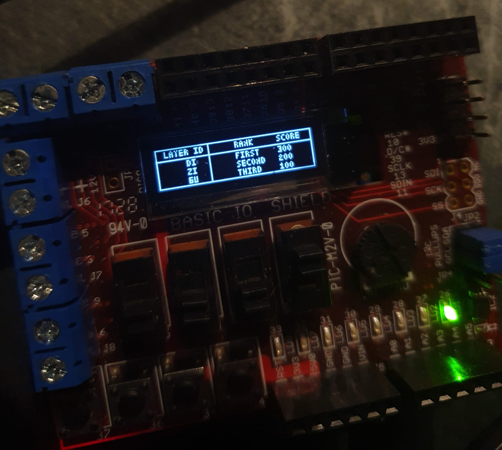

## Project Specifications

- **Project ID:** Advanced Mini-Project — _Tetris_
- **Programming Languages:** C & Assembly
- **Developed By:** Daniel Ibrahimi & Naveed Rahman
- **Instructor:** Marco Chiesa
- **Course ID:** IS1200
- **Institution:** KTH | CINTE1
- **Date:** 2/3-23

---

# Snapshot of the Result

<p align="center">
  
  
</p>

---

# Guide

This project is designed for **UNO32 boards** and requires the **MCB32 toolchain** (C compiler) to compile and install the game.

Follow the installation instructions here:  
https://github.com/is1200-example-projects/mcb32tools/releases

### Steps to build and install

1. Install the MCB32 toolchain.
2. Open the **MCB32 Toolchain terminal**.
3. Navigate to the project folder.
4. Compile the project:

```bash
   make
```

5. Upload the compiled program to the UNO32 board:

```bash
make install TTYDEV=/dev/<usb-address>
```

## Game Information

- The game is played **vertically**, but the **menu** and **leaderboard** are displayed **horizontally**.
- **btn 1** → _ESC_
- **btn 4** → _Rotate / ENTER_
- **btn 2 & 3** → _Move left/right_
- **Switches** → Control randomization seed for the next tetromino
- **LEDs** → Display current level
- **btn 2 & 3** → Navigate menus or alphabets
- Level increases automatically after reaching specific score thresholds.

### Level Progression

| Level | Score Required |
| ----- | -------------- |
| **2** | 100 points     |
| **3** | 500 points     |
| **4** | 1000 points    |
| **5** | 2000 points    |
